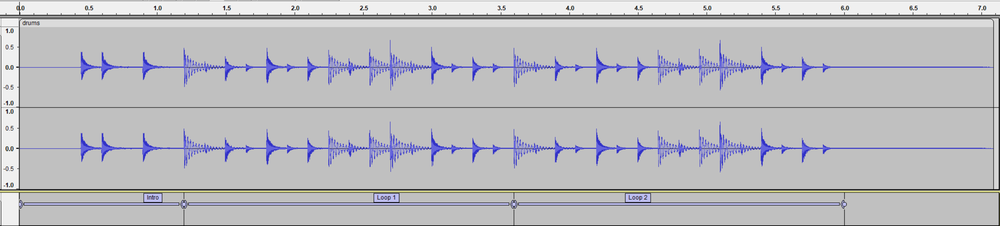

# Kira examples

This repo contains a number of small examples demonstrating Kira's capabilities.
To run an example, open a terminal at the root of this directory and run:

```
cargo run -p [example-name]
```

where `example-name` is the name of a subdirectory in the `crates` directory.

## Simple Sound Playback

```
cargo run -p simple-sound-playback
```

This is a bare minimum example of playing a sound with Kira. A `StaticSoundData`
is loaded and cloned each time it needs to be played. This does not take much
extra memory, since all clones of a `StaticSoundData` share the same copy of the
audio samples.

## Seamless Loop with Intro

```
cargo run -p seamless-loop-with-intro
```

This example uses the `loop_region` option to play a looping music track with an
intro section without any jarring cuts in the music.

The music is rendered out to have the intro and then 2 loops of the looping part
of the music. Kira is set to play the second loop repeatedly. This allows any
reverb tails from the end of loop 2 to seamlessly connect to the reverb tails
from the end of loop 1.



## Score Counter

```
cargo run -p score-counter
```

This example turns off the loop region of a looping sound to simulate a score
counter sound effect from an older game like Super Mario Bros.

## Metronome

```
cargo run -p metronome
```

This example uses a clock to play sounds in perfect time with a consistent
pulse. Each time the clock ticks, the next metronome click sound is queued up
for the next clock tick.

## Ghost Noise

```
cargo run -p ghost-noise
```

This example plays a single-cycle sine wave with the playback rate linked to an
LFO modulator, causing the pitch to move up and down, creating a cartoon ghost
sound effect. The LFO has its amplitude and frequency linked to two other LFO
modulators, giving the sound more complexity and variation.

## Dynamic Music

```
cargo run -p dynamic-music
```

This example uses a tweener modualtor to various parameters of multiple music
layers played simultaneously, which is useful for dynamic music. Imagine you're
playing a platformer with above-water and underwater sections where the music
changes when you go underwater.

## Spatial Audio

```
cargo run -p spatial-audio
```

This example uses [`macroquad`](https://crates.io/crates/macroquad) to set up a
simple 3D scene with a fly camera controller and a green cube. A drum loop plays
from the green cube. Use the arrow keys or WASD to move and the mouse to look
around. The volume and panning of the music will change according to the
camera's position and direction.
